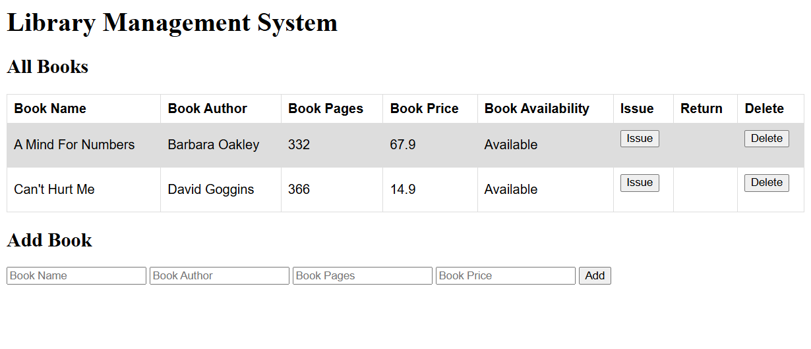

<a id="readme-top"></a>

<div> 
  <a href="https://www.youtube.com/@AlmeidaVerse" target="_blank"></a>
  <a href = "mailto:almeidaleo.dev@gmail.com"></a>
  <a href="https://www.linkedin.com/in/almeidaleo-dev/" target="_blank"></a> 
</div>

<br />

<!-- PROJECT LOGO -->
<div align="center">
  <a href="https://github.com/AlmeidaLeoDev/EventosPro">
    
  </a>
  <h3 align="center">Library Management System</h3>
</div>


<div>
  <div align="center">
    A simple Library Management System built with Node.js, Express, and EJS that allows administrators to manage books and users in a library.
  </div>

  <div align="center">
    <a href="#about-the-project"><strong>Explore the docs »</strong></a>
  
  <p>
    <br />
    <a href="#usage">View Demo</a>
  </p>
</div>


<!-- TABLE OF CONTENTS -->
<details>
  <summary>Table of Contents</summary>
  <ol>
    <li>
      <a href="#about-the-project">About The Project</a>
      <ul>
        <li><a href="#built-with">Built With</a></li>
      </ul>
    </li>
    <li>
      <a href="#getting-started">Getting Started</a>
      <ul>
        <li><a href="#prerequisites">Prerequisites</a></li>
        <li><a href="#installation">Installation</a></li>
      </ul>
    </li>
    <li><a href="#usage">Usage</a></li>
    <li>
      <a href="#contributing">Contributing</a>
      <ul>
        <li><a href="#top-contributors">Top contributors</a></li>
      </ul>
    </li>
  </ol>
</details>


<!-- ABOUT THE PROJECT -->
## About The Project

Main Objectives:

* Develop a complete library management system that handles book inventory and user transactions.
* Implement CRUD operations (Create, Read, Update, Delete) for book management.
* Create dynamic views using EJS templating engine.
* Handle form submissions with body-parser middleware.
* Maintain application state using in-memory data storage.

</br>

### Built With

[](https://developer.mozilla.org/en-US/docs/Web/JavaScript)
[](https://nodejs.org/en)
[](https://developer.mozilla.org/en-US/docs/Web/HTML)
[](https://developer.mozilla.org/en-US/docs/Web/CSS)

<br />
<p align="left">(<a href="#readme-top">Back to top</a>)</p>
<br />

<!-- GETTING STARTED -->
## Getting Started

Instructions on how you can set up your project locally.

### Prerequisites

* Git: To clone the repository.
* Node.js installed on your machine
* Express: Framework for the backend
* EJS: Templating engine for the frontend.
* npm (comes with Node.js)
* Body-parser: Middleware for form handling
* Basic understanding of JavaScript and Node.js


### Installation

Below you will find instructions on how to install and configure your application.

**1. Clone the Repository**

Open your terminal and run:

```bash
git clone https://github.com/AlmeidaLeoDev/Library-Management-System
```
Then navigate to the project directory:
```bash
cd Library-Management-System
```

**2. Initialize a new Node.js project**

```bash
npm init -y
```

**3. Install the required dependencies**

```bash
npm install express ejs body-parser
```

**4. Start the server**

```bash
node app.js
```

**5. Open your browser and visit**

```bash
http://localhost:3000
```

<br />
<p align="left">(<a href="#readme-top">Back to top</a>)</p>
<br />


<!-- USAGE -->
## Usage

Demonstration of how the project can be used

<div align="left">

**1. Add a Book: Fill out the form with book details and submit**

**2. Issue a Book: Enter the book name and click "Issue"**

**3. Return a Book: Enter the book name and click "Return"**

**4. Delete a Book: Enter the book name and click "Delete"**

<br/>



<br />
<p align="left">(<a href="#readme-top">Back to top</a>)</p>
<br />


<!-- CONTRIBUTING -->
## Contributing

### Top contributors

<table>
  <tr>
    <td align="center">
      <a href="https://www.linkedin.com/in/almeidaleo-dev/" target="_blank">
        <br>
        <sub>
          <b>Leonardo Almeida</b>
        </sub>
      </a>
    </td>
</table>

<br />
<p align="left">(<a href="#readme-top">Back to top</a>)</p>
<br />